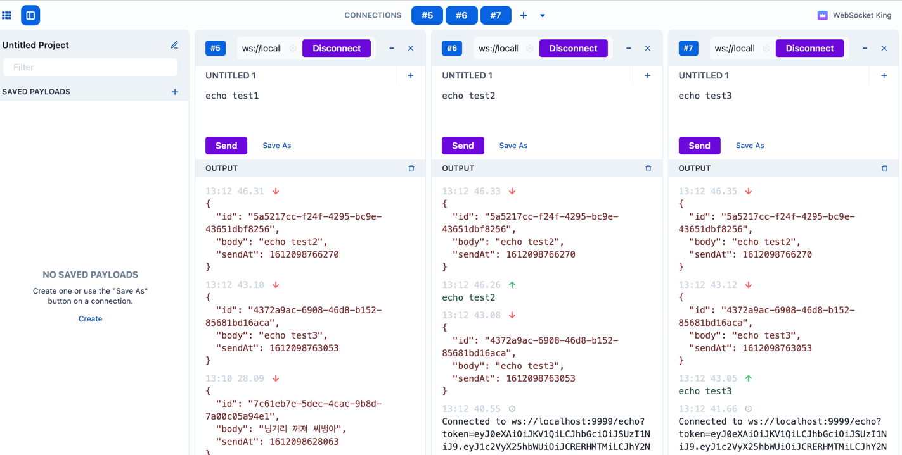

# client-push
zoo project의 client push 역할을 담당한다.

## Table of Contents

- **[Client Push 특성](#Features)**

- **[Project 및 패키지  구성](#Project-패키지-구성)**

- **[Documentation](#Documentation)**

- **[Setup](#Setup)**

- **[Running Client Push Server](#Running-Client-Push-Server)**

- **[배포 CI/CD](#배포-CI/CD)**

## Features
`라이더앱`, `컨트롤룸`, `관제` 등에 `라이더 위치정보`,`주문정보등록/변경`,`공유정보`,`사용자/허브설정정보` 등을 push 한다.

### Skill
* spring webflux
* spring reactive websocket 
* spring data reactive redis
* spring data r2dbc
* spring reactive kafka
* gradle project

### Server dependency
* postgresql
* kafka
* redis ? (NoSQL)
* data-server
* client-api
* open-api

## Project 패키지 구성

```sh
├─client-push
   │  README.md
   │  DockerFile
   │  build.gradle
   ├─docker
   │    docker-compose.yml  (redis, kafka local에 구성)
   │
   ├─src/main/java
   │   │  ClientPushApplication
   │   ├─ io/bargo/push (허브컨트롤룸)
   │   │   │
   │   │   ├─ api (webflux controller)
   │   │   │  
   │   │   ├─ common (공통모듈)
   │   │   │
   │   │   ├─ config (프로젝트 설정 정보)
   │   │   │  kafka, redis, r2dbc config
   │   │   ├─ handler (websocket handler)
   │   │   │  websocket 실제 구현 handler
   │   │   ├─ model 
   │   │   │  └─ dto
   │   │   │  └─ entity (r2dbc entity)
   │   │   │
   │   │   ├─ publisher (global publisher)
   │   │   ├─ repository
   │   │   └─ service
   │   │    
   │   └─src/main/resources  
   │
   └─src/test/main       
       │    
       └─src/test/resources  
```

## Documentation
- [Client Push 분석](https://www.notion.so/barogohq/Client-Push-478e2db809e2497590ba135e3af0a81d)

## Setup

> docker-compose 부분은 추후, root docker-compse와 통합하여 관리예정 

### docker-compose local setting (redis, kafka 설치)
```bash
docker-compose -f ./docker/docker-compose.yml up -d
``` 
option -d 일 경우 backgroud 실행 로그를 보고싶다면 -d 없이 실행

### docker-compose run check
```bash
 docker-compose -f ./docker/docker-compose.yml  ps
        Name                      Command               State                         Ports                       
------------------------------------------------------------------------------------------------------------------
zoo-kafka              start-kafka.sh                   Up      0.0.0.0:9092->9092/tcp                            
zoo-redis-standalone   docker-entrypoint.sh redis ...   Up      0.0.0.0:6001->6001/tcp, 6379/tcp                  
zoo-zookeeper          /bin/sh -c /usr/sbin/sshd  ...   Up      0.0.0.0:2181->2181/tcp, 22/tcp, 2888/tcp, 3888/tcp

```

## Running Client Push Server

### Running
```bash
./gradlew build
./gradlew bootRun 
```

### Websocket Test

#### Websocket client tool 설치
- [설치파일 Download](https://chrome.google.com/webstore/detail/websocket-king-client/cbcbkhdmedgianpaifchdaddpnmgnknn)

#### Websocket Demo endpoint





> 현재 port는 9999 로써 추후 수정 예정

- echo demo
```bash
ws://localhost:9999/echo?token={{ACCESS_TOKEN}}
```

- redis demo
```bash
ws://localhost:9999/redis?token={{ACCESS_TOKEN}}
```

- kafka demo
```bash
ws://localhost:9999/kafka?token={{ACCESS_TOKEN}}
```

## 배포 CI/CD

> 추후 설정 필요


